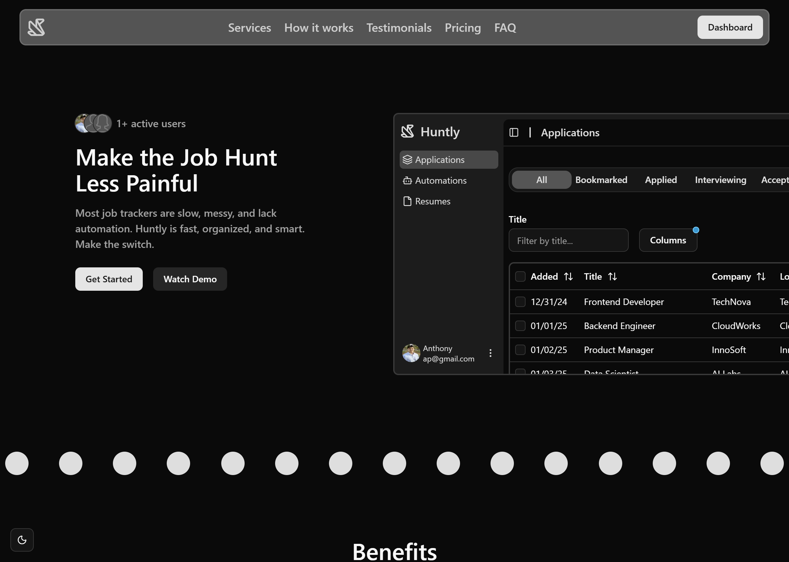

<div align="center">
   
</div>

<div align="center" >


)


</div>

Huntly is a web app for job seekers that helps you organize and track your applications while using AI to automate tasks like generating fit scores, cover letters, application answers, and project ideas—so you can focus on landing the right job faster.

<div align="center">
Click to try the demo
</div>

<div align="center">
  <a href="https://huntly-ebon.vercel.app/">
    
  </a>
</div>


## Table of Contents
- [Features](#features)
- [Installation](#installation)
- [License](#license)

## Features
- Application Tracking
- Resume Tracking
- AI Integrations/Automations
- Analytics

## Installation

### Prerequisites

- [Node.js](https://nodejs.org/) **v22.17.0** (recommended)
- A package manager: [pnpm](https://pnpm.io/), [npm](https://www.npmjs.com/) or [yarn](https://yarnpkg.com/),

### Clone the repository

```bash
git clone https://github.com/anthonypiegaro/Huntly.git
cd Huntly
```

### Install dependencies

Using **pnpm**:
```bash
pnpm install
```

Using **npm**:
```bash
npm install
```

Using **yarn**:
```bash
yarn install
```

### Environment variables, API keys, and database
Huntly uses [Better-Auth](https://www.better-auth.com/) for the authentication. Most of the Better-Auth configuration will already be set up. There are only a few steps you'll need to get it up and running:

1. Set up Better-Auth environment variables
    - Follow step 2 in the docs for how to set these variables: [Better-Auth env](https://www.better-auth.com/docs/installation#set-environment-variables)
2. Choose one of the two options: (1) Use preconfigured Google OAuth or (2) configure your own authentication options
    1. Board is configured to use Google OAuth by default. To get started, you will need to create and add Google OAuth API keys. Follow only the first step in the [Better-Auth Guide](https://www.better-auth.com/docs/authentication/google#get-your-google-credentials). Save the redirect uri from your Google here as well. After you save your keys, add them as environment variables:

        ```
        GOOGLE_CLIENT_ID=your-google-client-id
        GOOGLE_CLIENT_SECRET=your-google-client-secret
        GOOGLE_REDIRECT_URI=your-application-domain/api/auth/callback/google
        ```

    2. If you prefer not to use the preconfigured authentication methods, you can customize yourself. Refer to the [Better-Auth Authentication Section](https://www.better-auth.com/docs/authentication/email-password).

Huntly uses [Drizzle](https://orm.drizzle.team/docs/overview) for the ORM layer and PostgreSQL for the database. Use the [Drizzle Guides](https://orm.drizzle.team/docs/get-started) to set up your preferred PostgreSQL provider.

Huntly uses [Upstash](https://upstash.com/) for the rate limiter. Use the [Upstash Rate Limit Guide](https://upstash.com/docs/redis/sdks/ratelimit-ts/overview) to set up your rate limiter. 

### Start
To start, run
```bash
# Using pnpm
pnpm run dev

# Using npm
npm run dev

# Using yarn
yarn dev
```

## License
This project is licensed under the [MIT License](LICENSE).